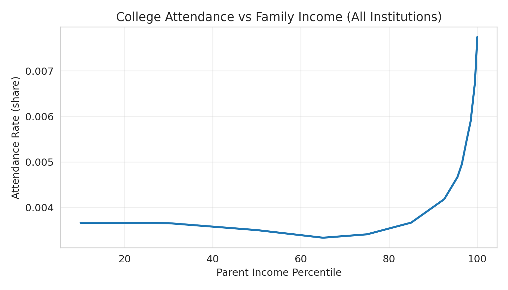
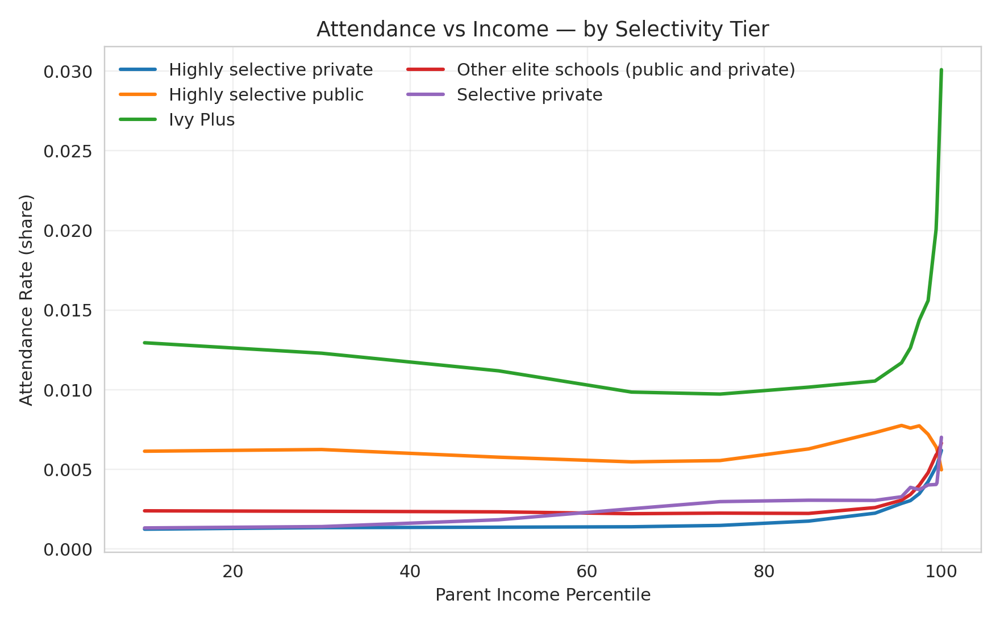

# 📊 College Enrollment & Income Analysis

## 📈 Finding 1: Income is a Powerful Driver of Enrollment

College attendance increases steadily as **parent income percentile rises**.

### 📊 Trend Explanation

* The plot shows a **clear upward linear trend**.
* Students from **low-income families** have the lowest attendance rates.
* Attendance **consistently increases** with higher income levels.

### 📉 Data Insight

* The attendance gap between:

  * **Top 20% income group**
  * **Bottom 20% income group**
* Is approximately **0.0019**

👉 This demonstrates a measurable link between **family wealth and access to higher education**.

---

## 🏫 Finding 2: College Type Amplifies the Income Gap

The impact of income becomes **more pronounced at elite institutions**.

### 🔍 Breakdown by College Tier

#### 🎓 Ivy Plus Institutions

* Largest enrollment gap: **0.00333**
* Strongest advantage for high-income students

#### 🎓 Highly Selective Private Schools

* Gap: **0.00255**
* Still significantly influenced by income

### 🧠 Conclusion

Financial advantage is **most concentrated at the top-tier colleges**, reinforcing inequality at the highest levels of education.

---

### 📉 Key Numbers

* Overall gap (Top 20% vs Bottom 20%): **0.00189**
* Ivy Plus gap: **0.00333**

👉 These figures provide **quantifiable evidence of inequality**, not just observations.

---

## ⚖️ Conclusion: A Call for Educational Equity

### 🧾 Summary

* Access to college is **not equally distributed**
* Higher-income students have **greater access**, especially to elite institutions

### 🚨 The Challenge

* Income disparity is **reinforcing social class divisions**
* The **0.00333 gap** at top institutions highlights deep inequality

### 💡 Call to Action

These findings raise important questions about:

* Admissions policies
* Financial aid systems
* Equal opportunity in education

👉 The goal is to move toward **true educational equity**
